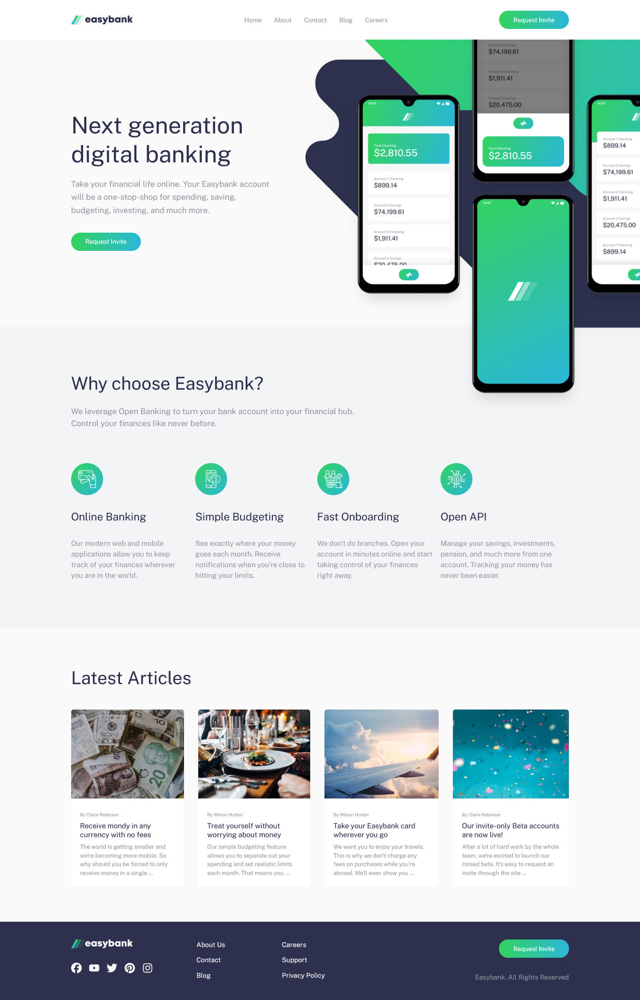

# Frontend Mentor - Easybank landing page solution

This is a solution to the [Easybank landing page challenge on Frontend Mentor](https://www.frontendmentor.io/challenges/easybank-landing-page-WaUhkoDN). Frontend Mentor challenges help you improve your coding skills by building realistic projects.

## Table of contents

- [Overview](#overview)
  - [The challenge](#the-challenge)
  - [Screenshot](#screenshot)
  - [Links](#links)
- [My process](#my-process)
  - [Built with](#built-with)
  - [What I learned](#what-i-learned)
  - [Useful resources](#useful-resources)
- [Author](#author)

## Overview

### The challenge

Users should be able to:

- View the optimal layout for the site depending on their device's screen size
- See hover states for all interactive elements on the page

### Screenshot



### Links

- Solution URL: [Repository Link](https://github.com/mjclaypool/Easybank-Landing-Page)
- Live Site URL: [Live Link](https://mjclaypool.github.io/Easybank-Landing-Page/)

## My process

### Built with

- Semantic HTML5 markup
- CSS custom properties
- Flexbox
- Mobile-first workflow
- TypeScript
- [React](https://reactjs.org/) - JS library
- [Tailwind CSS](https://tailwindcss.com/) - For styles

### What I learned

This was my first project using TypeScript, so I learned how to define and use type-specific variables. I look forward to working with TypeScript on larger projects in the future where its type safety and refactoring support would have a greater impact.

```js
const navLinks: string[] = ["Home", "About", "Contact", "Blog", "Careers"];
```

### Useful resources

- [Tailwind CSS Documentation](https://tailwindcss.com/docs/installation) - This well-documented reference website helped me efficiently transition from vanilla CSS to Tailwind CSS. It is a popular CSS framework that promotes increased efficiency in styling applications.
- [Font Awesome Icon](https://fontawesome.com/icons) - This is pretty comprehensive library of classic and brand icons. It also offers various ways to add icons to your project, like via global import in React or copy/paste the svg tag.

## Author

- Website - [Mallory Claypool](https://mjclaypool.github.io/Personal-Portfolio/)
- Frontend Mentor - [@mjclaypool](https://www.frontendmentor.io/profile/mjclaypool)